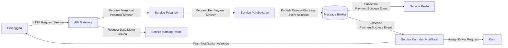

# Tugas 2 (Pekan 2) — Perancangan Arsitektur untuk FoodGo

## Kelompok 6

## Pemilihan Gaya Arsitektur

  Berdasarkan masalah pada Tugas 1, FoodGo mengalami kendala karena seluruh fungsi seperti pesanan, pembayaran, notifikasi kurir, dan katalog resto masih berjalan dalam satu aplikasi monolitik. Sehingga, kondisi tersebut menyebabkan perubahan pada satu komponen yang dapat mempengaruhi komponen lain dan proses deployment harus dilakukan secara bersamaan.
  
  Untuk Mengatasi masalah tersebut, FoodGo menggunakan kombinasi:
  
  1. Service-Oriented Architecture (SOA) sebagai struktur utama.
  2. Publish-Subscribe sebagai pola komunikasi untuk proses event dan notifikasi.

  SOA dipilih karena kebutuhan utama FoodGo adalah memisahkan fungsi utama menjadi service yang berdiri lebih independen. Dengan pendekatan ini, modul pesanan, pembayaran, katalog resto, dan kurir dapat dikembangkan serta dilakukan deployment secara terpisah.

  Publish-Subscribe digunakan pada proses yang tidak membutuhkan respons langsung, terutama untuk notifikasi. Dengan adanya message broker, service pengirim event tidak perlu mengetahui detail service penerima. Hal ini membuat hubungan antar modul menjadi lebih longgar (loosely coupled).

  Kombinasi ini sesuai dengan kebutuhan FoodGo karena komunikasi antar service yang membutuhkan hasil langsung tetap dapat menggunakan request-response, sedangkan proses seperti notifikasi kurir dapat menggunakan komunikasi asynchronous berbasis event.

---

## Diagram Arsitektur FoodGo

  Berikut rancangan arsitektur FoodGo menggunakan Service-Oriented Architecture (SOA) dengan pola Publish-Subscribe untuk komunikasi event.

## Penjelasan Interaksi Komponen
### 1. Service Pesanan

  Service Pesanan menangani proses utama ketika pelanggan membuat pesanan. Service ini menerima data order dari pelanggan dan mengatur perubahan status pesanan.

  Alur Komunikasinya:
  - Pelanggan mengirim permintaan melalui API Gateway menggunakan HTTP request.
  - API Gateway meneruskan permintaan tersebut ke Service Pesanan.
  - Service Pesanan melakukan komunikasi dengan Service Pembayaran untuk memastikan transaksi berhasil.

   Komunikasi antara Service Pesanan dan Service Pembayaran menggunakan request-response secara sinkron karena hasil pembayaran masih diperlukan untuk menentukan status pesanan.

### 2. Service Pembayaran

  Service Pembayaran bertanggung jawab untuk memproses transaksi pembayaran pelanggan setelah menerima permintaan dari Service Pesanan.
  
  Alur Komunikasinya:
  - Service Pesanan mengirim data pembayaran ke Service Pembayaran menggunakan request-response.
  - Service Pembayaran melakukan proses transaksi.
  - Setelah pembayaran berhasil, Service Pembayaran mengirim event `PaymentSuccess` ke Message Broker.

    Komunikasi antara Service Pesanan dan Service Pembayaran menggunakan request-response secara sinkron karena Service Pesanan masih membutuhkan hasil pembayaran untuk melanjutkan proses pesanan.

    Sedangkan komunikasi Service Pembayaran dengan Message Broker menggunakan publish event secara asynchronous karena service lain dapat menerima informasi pembayaran tanpa harus dipanggil secara langsung.

### 3. Service Katalog Resto

  Service Katalog Resto digunakan untuk menyediakan informasi restoran dan menu yang tersedia pada aplikasi FoodGo.

  Alur Komunikasinya:
  - Pelanggan meminta informasi restoran melalui aplikasi.
  - API Gateway meneruskan permintaan tersebut ke Service Katalog Resto.
  - Service Katalog Resto memberikan data restoran dan menu kepada pelanggan.

  Komunikasi antara API Gateway dan Service Katalog Resto menggunakan HTTP request-response secara sinkron karena pelanggan membutuhkan data secara langsung ketika melihat katalog.

  Service Katalog Resto dibuat terpisah agar perubahan data restoran atau menu tidak memengaruhi service lain seperti pesanan dan pembayaran.

### 4. Service Kurir dan Notifikasi

  Service Kurir dan Notifikasi bertugas memberikan informasi kepada kurir serta pelanggan mengenai perkembangan pesanan.

  Alur Komunikasinya:
  - Service Pembayaran mengirim event `PaymentSuccess` melalui Message Broker setelah pembayaran berhasil.
  - Service Kurir dan Notifikasi menerima event `PaymentSuccess` melalui mekanisme subscribe.
  - Service Kurir melakukan proses penugasan berdasarkan informasi pesanan.
  - Sistem mengirimkan notifikasi kepada kurir dan pelanggan.

  Komunikasi antar Message Broker dan Service Kurir/Notifikasi menggunakan subscriber event secara asynchronous karena proses notifikasi tidak harus selesai sebelum pesanan dapat diproses.

### 5. Message Broker

  Message Broker berfungsi sebagai penghubung komunikasi event antar service FoodGo.

  Alur Komunikasinya:
  - Service Pembayaran melakukan publish event `PaymentSuccess`.
  - Service Resto serta Service Kurir dan Notifikasi menerima event yang dibutuhkan melalui subscribe.

  Penggunaan Message Broker tidak perlu mengetahui detail service lain yang menerima event sehingga hubungan antar modul menjadi lebih longgar.

## Skenario End-to-End
### Pelanggan Membuat Pesanan
1. Pelanggan memilih menu restoran melalui aplikasi FoodGo.
2. Request dikirim ke API Gateway menggunakan komunikasi HTTP request-response secara sinkron.
3. API Gateway meneruskan permintaan tersebut ke Service Pesanan.
4. Service Pesanan membuat data pesanan dan mengirim permintaan pembayaran ke Service Pembayaran menggunakan komunikasi request-response sinkron.
5. Service Pembayaran melakukan proses transaksi pembayaran.
6. Setelah pembayaran berhasil, Service Pembayaran melakukan publish event `PaymentSuccess` ke Message Broker menggunakan komunikasi asynchronous.
7. Message Broker meneruskan event `PaymentSuccess` kepada service yang melakukan subscribe:
   - Service Resto menerima informasi bahwa terdapat pesanan yang sudah dibayar.
   - Service Kurir dan Notifikasi menerima informasi untuk memulai proses pencarian dan penugasan kurir.
8. Service Kurir dan Notifikasi melakukan proses pencarian kurir yang tersedia.
9. Setelah kurir berhasil ditentukan, sistem mengirimkan notifikasi kepada:
    - Kurir mengenai tugas pengantaran.
    - Pelanggan mengenai status pesanan.

Dengan alur tersebut, proses utama pesanan dan pembayaran tidak bergantung langsung terhadap service resto maupun service kurir. Apabila Service Kurir mengalami gangguan, proses pembayaran tetap dapat berjalan karena komunikasi dilakukan melalui Message Broker.

## Analisis Mengatasi Masalah Coupling
    
  Arsitektur SOA dengan tambahan Publish-Subscribe membantu mengurangi coupling pada FoodGo karena setiap service memiliki tanggung jawab yang lebih jelas.

  Pada arsitektur monolitik sebelumnya, perubahan pada satu komponen dapat menyebabkan seluruh aplikasi harus melakukan deployment ulang. Dengan service terpisah, perubahan pada modul pembayaran tidak harus menyebabkan service katalog resto atau service notifikasi ikut berhenti.

  Penggunaan message broker juga mengurangi ketergantungan langsung antar service. Service Pembayaran hanya perlu mengirim event tanpa mengetahui service mana saja yang menerima event tersebut.

  Contohnya, ketika FoodGo ingin menambahkan fitur baru seperti analisis promo atau riwayat pesanan, service baru dapat melakukan subscribe terhadap event yang sudah tersedia tanpa mengubah Service Pesanan.

## Trade-off Arsitektur
Walaupun memberikan fleksibilitas lebih tinggi, arsitektur ini memiliki beberapa konsekuensi.

### 1. Kompleksitas Infrastruktur Bertambah

  Pada sistem monolitik, komunikasi antar modul terjadi dalam satu aplikasi. Setelah dipisahkan menjadi beberapa service, FoodGo harus mengelola:
  - Komunikasi antar service,
  - Deployment beberapa service,
  - Monitoring,
  - Logging,
  - Keamanan API.

### 2. Debugging Menjadi Lebih Sulit

  Pada komunikasi Publish-Subscribe, alur proses tidak selalu berjalan secara linear.
  Contohnya, ketika pelanggan tidak menerima notifikasi kurir, penyebab masalah dapat berasal dari:
  - Service Pesanan,
  - Message Broker,
  - Service Notifikasi,
  - Sistem Push Notification.

  Karena itu diperlukan sistem monitoring dan tracing antar service.

### 3. Konsistensi Data Tidak Selalu Langsung

  Komunikasi asynchronous membuat beberapa data dapat berada dalam kondisi sementara. Contohnya, pembayaran sudah berhasil, tetapi notifikasi resto belum diterima.

  FoodGo perlu menangani status sementara seperti processing atau waiting confirmation.

## Kesimpulan

  SOA dengan pola Publish-Subscribe dapat menjadi solusi untuk masalah arsitektur FoodGo karena mampu memisahkan service utama dan mengurangi ketergantungan antar komponen.

  Service seperti Pesanan, Pembayaran, Katalog Resto, dan Kurir dapat berkembang secara independen. Namun, pendekatan ini membutuhkan pengelolaan tambahan seperti message broker, monitoring, dan mekanisme penanganan kegagalan komunikasi.
    
  

  

